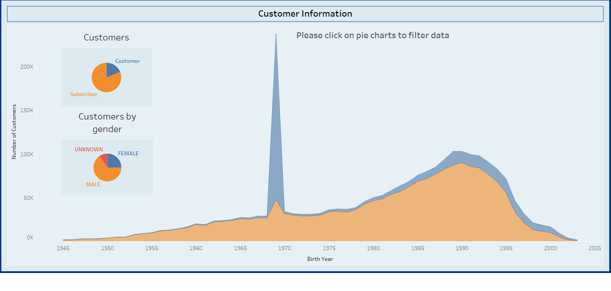
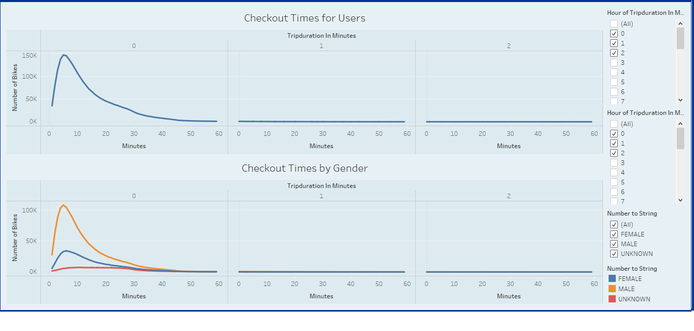
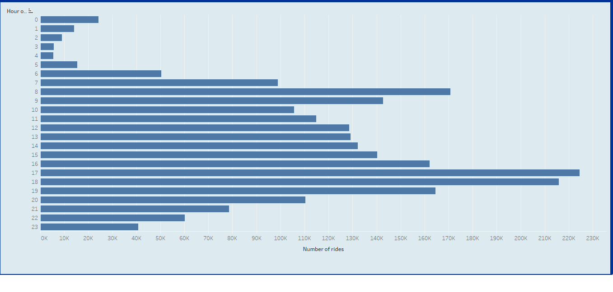
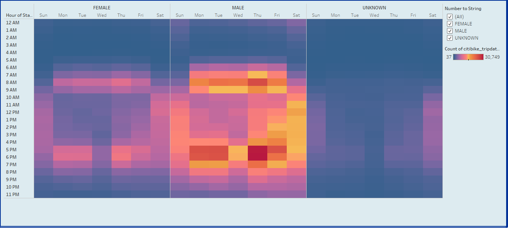
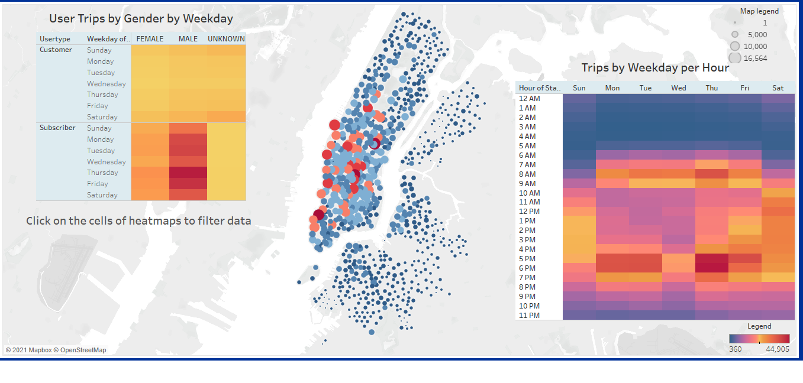
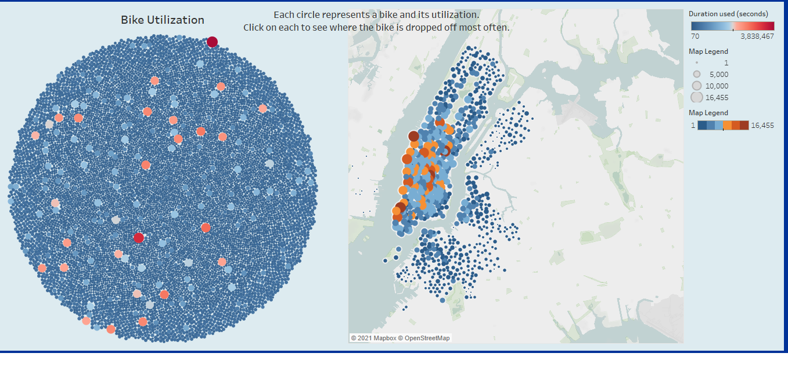
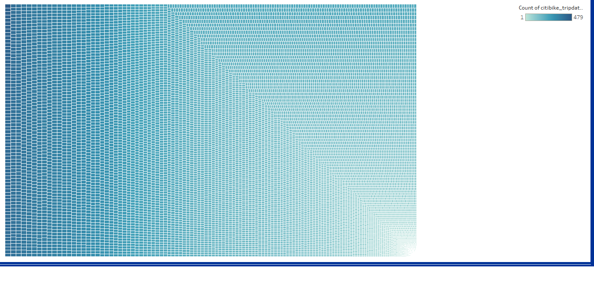

# New York City Citi Bike Analysis
## Project overview: 
The following report summarizes the statistical analysis and visualization of bikesharing data for August 2019 of Citi Bike in New York city. The analysis is conducted with the aim to demonstrate the viability of a similar undertaking in Des Moines.

## Results: 
Analysis is summarized in the following visualizations.

1. Customer Information.

There were a total of 2,344,224 customers in August 2019. The dashboard, demonstrated in the image above, has filter functionality by which clients can filter for further data based on the type of customer and gender. 

2. The duration of time bikes are checked out. 

The image above demonstrates dashboard with filterning functionality. Clients can filter the data based on data, and the duration of bike checkouts, as well as gender. The data shows that most bules are used for no longer than 30 minutes.

3. August peak hours

Data shows that the peak hours in August are between 7AM and 9AM, and 4PM and 7PM. 

4. Gender breakdown of peak hours

Data demonstrates that peak hours are mostly populated by persons that identify as male.

5. Popular start stations by gender and peak hours per every weekday

The image above demonstrates a dashboard in which clients can view popular locations based on gender, customer type, peak time and day. The most popular stations during peak     hours are in downtown Manhattan. 

6. Bike utilization and popular dropoff stations for bikes

On the above dashboard, clients can see the most utilized bikes and the most popular stations of drop off of the bikes by filtering the data. 

7. Bike Repairs

The tree visualization allows the clients to visuzalize and identify bikes are that may be in need of repairs based on the number of trips taken on the bikes.

### Please follow the link to explore the data yourself: [link to dashboard](https://public.tableau.com/shared/W7XZN3BYM?:display_count=y&:origin=viz_share_link "link to dashboard")

## Summary: 

Data demonstrates that bikes sharing is most popular in the morning and late afternoons in downtown Manhattan. This allows us to conclude that bikesharing is popular among commuters given the large proportion of subscribed customers. Furthermore, despite the low proportion of unsubscribed customers, the large number of trips taken by them suggests the popularity of bikesharing among tourists in Manhattan. Data also suggests that bikesharing is more popular among males than females. 

Overall, the analysis of August 2019 bikesharing data in New York warrants the market analysis of Des Moines and suggests the feasibility of a similar undertaking. 

Suggestions for further visulizations: 

1. Visualization of types of customers based on birth year, as demonstrated in image 1 above. 
2. Clients may also benefit from visualization of the number of bikes available in each station and their utilization because iamge 6 above suggests overuse of a few bikes and underuse of too many bikes given the number of total trips. 

